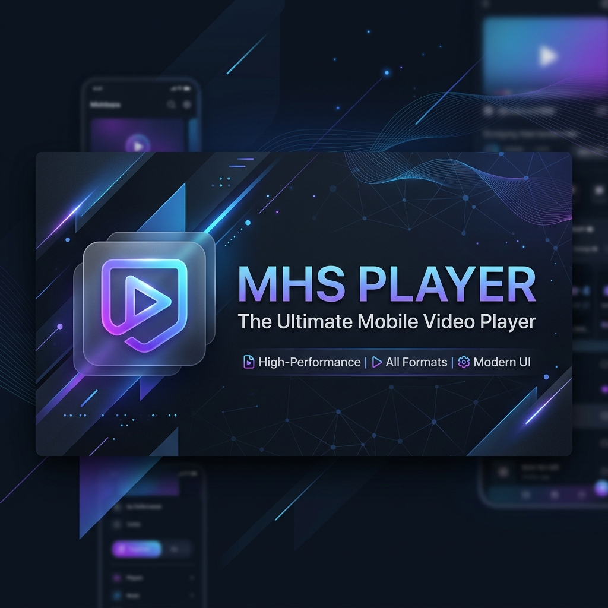

# MHS PLAYER 📽️



MHS PLAYER is a high-performance, premium open-source media player for Android built entirely with **Jetpack Compose** and **Media3 (ExoPlayer)**. It is meticulously designed with a modern glassmorphic Material 3 interface, advanced offline machine-learning-based translation pipelines, and customized local native decoders.

---

## 💎 Features

### 🚀 Performance & Native Decoding
- **Local FFmpeg Decoding Engine**: Integrated custom-compiled release AAR of `lib-decoder-ffmpeg` supporting advanced audio formats (EAC3, Dolby Digital Plus, DTS, TrueHD) out-of-the-box.
- **Android 15 Compatibility (16KB Page Size)**: Native library compiled with 16KB page-alignment and `extractNativeLibs="true"` to run flawlessly on next-generation Android architectures.
- **HW Acceleration**: Full support for hardware-accelerated H.264, HEVC, and VP9 video decoding.

### 🎨 Modern & Responsive UX
- **Dynamic Glassmorphic Layouts**: Premium frosted-glass Material 3 sheets and overlay controls that adapt beautifully to high refresh rate (90Hz / 120Hz) displays.
- **Fluid Gesture Control System**:
  - *Vertical Swipe*: Control brightness (left screen half) and stream volume (right screen half) via sleek custom vertical HUD indicators.
  - *Horizontal Seek Scroll*: Scroll across screen space to preview seek offsets.
  - *Long-Press Accelerate*: Hold down on the right side of the screen to activate instant `2.0x` speed playback.
  - *Double-Tap to Jump*: Double-tap on screen margins to perform incremental forward/backward seeking.
- **Picture-in-Picture (PiP)**: Standard PiP mode support with auto-aspect ratio adaptation.

### 💬 Premium Subtitle & Translation Engine
- **Multi-Format Subtitle Parser**: High-performance local `.srt` and `.ass` parser.
- **Dual AI & Cloud Translation**:
  - *Gemini AI Translation*: Integration of generative translation models for cinema-grade local subtitle translation.
  - *Cloud Fallback API Chain*: Offline-friendly translation fallback using high-performance Lingva and Google translate APIs.
- **Interactive Search & Downloader**: Integrated OpenSubtitles and Malayalam Subtitles (MSone) providers to search, download, and instantly inject subtitles into active playback streams.

---

## 🛠️ Architecture & Package Structure

The project conforms to clean architectural guidelines with structured separation of concerns:

```
com.mhs.player
│
├── database/                    # Room DB schemas for favorites and history
├── di/                          # Dependency injection modules (Hilt)
├── media/                       # Media metadata indexing & folder hierarchy scanning
│   ├── detection/
│   ├── filesystem/              # Scoped storage resolvers and scanners
│   ├── folders/
│   └── sorting/
│
├── navigation/                  # Jetpack Compose Navigation Graph
│
├── player/                      # Core player systems
│   ├── ai/
│   │   └── translation/         # Cinema-grade AI translation engine
│   │       └── SubtitleTranslator.kt  # Gemini + cloud translation chain
│   │
│   ├── audio/                   # Equalizer, audio effects & audio-only player
│   │
│   ├── controller/              # Playback controller and queue systems
│   │   ├── PlayerController.kt  # Media3 ExoPlayer wrapper and unified state management
│   │   └── PlaybackManager.kt   # History tracking & playback session recovery
│   │
│   ├── controls/                # Composable player UI surface & overlay widgets
│   │   ├── GestureOverlay.kt    # Touch gesture detection composable
│   │   ├── CustomPlayerControls.kt
│   │   └── SubtitleSearchSheet.kt
│   │
│   ├── enhance/                 # GPU-accelerated Smart Enhance pipeline
│   │   └── SmartEnhanceEngine.kt
│   │
│   ├── gestures/                # High-precision gesture state management
│   │   └── GestureController.kt # Volume, brightness and seek handlers
│   │
│   ├── service/                 # Media3 Background Playback Service (MediaSession)
│   │
│   ├── subtitles/               # Subtitle structures, downloaders, and providers
│   │   ├── parser/              # High-performance .srt and .ass parser
│   │   └── providers/           # MSone, OpenSubtitles, and SubtitleCat plugins
│   │
│   └── utils/                   # Clean formatting and tag-stripping utilities
│       └── SubtitleUtils.kt
│
├── ui/                          # Screen layouts and theme specifications
│   ├── components/
│   ├── screens/
│   └── theme/                   # Glassmorphic design tokens and typography
│
└── settings/                    # DataStore preferences repository
```

---

## 🚀 Getting Started

### Prerequisites
- **Android Studio Koala** (2024.1.1) or newer.
- **Android SDK 35** (Compile SDK).
- **Java 17** (Ensure `JAVA_HOME` is pointed to a valid JDK 17 or Android Studio's bundled JBR).

### Local Setup & Compilation

1. **Clone the Repository**:
   ```bash
   git clone https://github.com/yourusername/mhs-player.git
   cd mhs-player
   ```

2. **Configure Local Environment**:
   Duplicate the provided configuration template at the root directory:
   ```bash
   cp local.properties.example local.properties
   ```
   Open `local.properties` and verify your local Android SDK location:
   ```properties
   sdk.dir=C:/Users/YourUsername/AppData/Local/Android/Sdk
   ```

3. **Compile Debug Build**:
   To compile the debug version of the application:
   - On Windows (PowerShell):
     ```powershell
     $env:JAVA_HOME="C:\Program Files\Android\Android Studio\jbr"
     ./gradlew assembleDebug
     ```
   - On macOS / Linux:
     ```bash
     export JAVA_HOME="/Applications/Android Studio.app/Contents/jbr/Contents/Home"
     ./gradlew assembleDebug
     ```

---

## 🤝 Contributing

Contributions are welcomed! If you find any issues or have feature recommendations:
1. Fork the project.
2. Create your feature branch (`git checkout -b feature/AmazingFeature`).
3. Commit your changes (`git commit -m 'Add some AmazingFeature'`).
4. Push to the branch (`git push origin feature/AmazingFeature`).
5. Open a Pull Request.

---

## 📜 License & Credits

Distributed under the **MIT License**. See `LICENSE` for details.

### Acknowledgements
- **AndroidX Media3 (ExoPlayer)** for the robust core playback interface.
- **FFmpeg Project** for the universal decoding engine.
- Built with ❤️ by the **MHS Team**.
