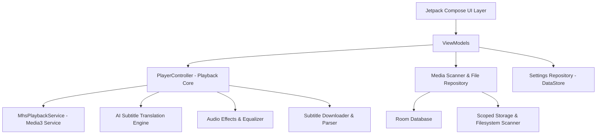

# MHS Player — Architecture Guide

Welcome to the **MHS Player** architecture guide. This document details the architectural patterns, data flow mechanisms, and framework integrations that power our premium open-source Android media player.

MHS Player is built with clean architecture principles, leveraging Modern Android Development (MAD) tools to provide a smooth, modular, and highly performant media playback system.

---

## Technical Stack & Principles

* **UI Framework:** Jetpack Compose (100% Declarative UI)
* **Dependency Injection:** Hilt (Dagger-based, compile-time verified DI)
* **Architecture Pattern:** MVVM (Model-View-ViewModel) + Unidirectional Data Flow (UDF)
* **Concurrency & Reactive Streams:** Kotlin Coroutines & Flow (StateFlow / SharedFlow)
* **Local Storage:** Room Database (Media cache, playback history) & Jetpack DataStore (User settings)
* **Media Framework:** Media3 ExoPlayer with customized extension decoders (FFmpeg, etc.)

---

## High-Level System Architecture

The project is structured into logical subpackages under `com.mhs.player` to isolate responsibilities:

---

## Component Walkthrough

### 1. Presentation Layer (`com.mhs.player.ui`)
The UI is composed entirely of declarative Compose screens. Important files and roles:
* **`MainActivity.kt`**: Single activity host managing window settings, edge-to-edge configuration, and navigation routing.
* **`screens/`**: UI screens like `HomeScreen`, `FoldersScreen`, `PlayerScreen`, and `ExternalPlayerScreen`.
* **`components/`**: Modular, reusable Compose elements.
* **`viewmodels/`**: State containers like `PlayerViewModel` that bridge UI interactions to the core controller, emitting stable state flows.

### 2. Core Infrastructure Layer (`com.mhs.player.core`)
Shared, feature-agnostic infrastructure providing foundational utilities:
* **`core/logging/MhsLogger.kt`**: Standardized logging utility wrapping standard Android Log APIs with automatic tags and diagnostic filtering.
* **`core/coroutine/DispatcherProvider.kt`**: Dependency-injectable coroutine dispatchers enabling clean thread management and unit testing isolation.
* **`core/constants/AppConstants.kt`**: Centralized single source of truth for global configurations, Notification Channels, and static flags.
* **`core/utils/ScreenshotHelper.kt`**: Clean utilities utilizing Android MediaProjection or view canvas rendering to capture video snapshots.

### 3. Media Scanning & Retrieval Layer (`com.mhs.player.media`)
Responsible for scanning the local storage, building virtual directory hierarchies, and reading metadata:
* **`MediaScanner.kt`**: Coordinates storage scanning across system media stores and scoped storage trees.
* **`FileResolver.kt`**: Resolves local storage URIs to absolute paths and extracts technical video parameters.
* **`FolderTreeBuilder.kt`**: Aggregates scanned media files into organized folder structures for hierarchical navigation.

### 4. Dependency Injection Layer (`com.mhs.player.di`)
Centralized Hilt modules that define bindings, scopes, and lifecycle management:
* **`AppModule.kt`**: Defines core application scopes, mapping repositories and managers.
* **`core/coroutine/CoroutineModule.kt`**: Binds the asynchronous thread dispatchers.
* **`player/subtitles/di/SubtitleModule.kt`**: Registers Retrofit web services, HTTP clients, and providers for the subtitle ecosystem.

### 5. Local Persistence Layer (`com.mhs.player.database` & `settings`)
* **`database/`**: Room database defining entities for `PlaybackHistory` and media cache. Ensures instantaneous startup loading without rescanning folders.
* **`settings/`**: Jetpack DataStore utilizing Proto DataStore/Preferences to persist subtitle languages, hardware decoder selections, equalizer presets, and interface themes.

---

## Lifecycle & State Flows

MHS Player adheres strictly to a **Single Source of Truth** pattern. 
All player state (playback state, current track, speed, subtitles, resizing mode) is exposed from `PlayerController` as read-only Kotlin `StateFlow` streams. 

UI elements collect these flows using Compose's lifecycle-aware collectors (`collectAsStateWithLifecycle()`), ensuring that resources are released when the app goes into the background, fully avoiding memory leaks and frame drops.
