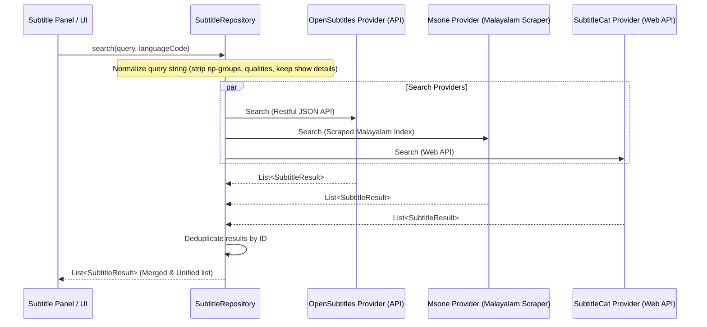

# MHS Player — Subtitle Subsystem & AI Translation Engine

MHS Player features a cinematic-grade subtitle processing pipeline. It combines robust, local multi-format parsing, multi-provider network searches, and an advanced, context-aware AI translation mechanism leveraging on-device LLM APIs (Google Gemini).

---

## 1. Local Subtitle Parsing Layer

All local subtitle parsing is managed inside the isolated `com.mhs.player.player.subtitles.parser` package by the custom-built, highly-optimized `SrtParser`.

### Supported Formats & Characteristics:
* **SubRip (`.srt`)**: Standard timing and styling. Supports multi-line blocks and HTML tag stripping (e.g. `<b>`, `<i>`, `<font>`).
* **WebGL Subtitle (`.vtt`)**: Auto-detects and processes SubRip-like timing styles (`-->` or `->`), cleaning metadata tags gracefully.
* **SubStation Alpha (`.ass` / `.ssa`)**: Advanced styled captions. Custom regex patterns parse out complex styling directives (e.g. `{\pos(10,20)\shad0}`) and extract raw text cues while preserving standard formatting tags.

### Robust Encoding Detection:
To prevent encoding errors and garbage character rendering, MHS Player features an adaptive byte-level encoding detector:
1. **UTF-16LE / UTF-16BE**: Scans files for initial byte order marks (BOM: `0xFF 0xFE` or `0xFE 0xFF`).
2. **UTF-8 with BOM**: Detects `0xEF 0xBB 0xBF`.
3. **Adaptive Fallback**: Gracefully tries UTF-8 decoder validation, falling back immediately to `Windows-1252` encoding if parsing fails.

---

## 2. Multi-Provider Subtitle Network

When subtitles are not found locally, MHS Player queries the `SubtitleRepository`, which orchestrates a concurrent search across multiple providers utilizing Retrofit:



### Search Normalization Algorithm
To maximize lookup hits, filenames are normalized using the `extractQueryFromFilename` algorithm, which cleans raw filenames (e.g. `The.Batman.2022.1080p.BluRay.x264.AAC5.1-FGT.mkv`) into simple, indexable search phrases (`The Batman 2022`). It extracts TV show details (`S01E03`) while discarding irrelevant release descriptors (`10bit`, `x265`, `HEVC`, `RARBG`, etc.).

---

## 3. Context-Aware AI Subtitle Translation Engine

The pinnacle of MHS Player's subtitle features is the `SubtitleTranslator`, located in the `com.mhs.player.player.ai.translation` package. This module runs dynamic, context-aware translations.

### Architecture:
* **Dual Pipeline Mechanism**:
  * **On-Device LLM API (Google Gemini)**: Offers human-grade translation by batching multiple subtitle cues. This enables the LLM to understand contextual references, slang, gender roles, and conversational flow, rather than translating line-by-line in a vacuum.
  * **Traditional Translate API Chain**: Google Translate & Lingva serve as fast, high-availability backups.
* **Intelligent Thread Concurrency**: Uses Kotlin `Semaphores` (capped at 5 concurrent requests) to throttle connections, preventing rate limits and IP blocking.
* **Concurrent LRU Cache**: Tracks translations dynamically (`ConcurrentHashMap`). Translating back-and-forth or repeating lines hits the memory cache, achieving zero latency and reducing API costs.

### Pre-Translation & Look-Ahead Engine:
To prevent latency during video playback, `SubtitleTranslator` includes a background look-ahead scheduler:
1. When a video starts or seeks, a coroutine job launches: `startPreTranslation(cues, targetLang, startPosMs)`.
2. The look-ahead system slices the upcoming subtitle list into chunks of 20 lines.
3. It filters out already-cached phrases and translates remaining lines in the background.
4. As the playhead advances, translated subtitles are instantly ready in memory, ensuring seamless, zero-lag playback.

### Gemini Subtitle Prompt Blueprint:
```text
Translate these movie subtitles strictly to [TARGET_LANGUAGE]. 
Requirements:
- Return ONLY a raw JSON object.
- Format: {"original": "translated"}
- Each "translated" value MUST be ONLY in [TARGET_LANGUAGE] language.
- NEVER include the original English text or any English explanations in the "translated" value.
- NO side-by-side (English + [TARGET_LANGUAGE]) translations.
- Preserve the emotional tone and context of the movie.
```
